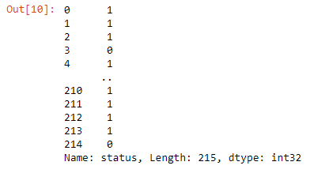

# Implementation-of-Logistic-Regression-Model-to-Predict-the-Placement-Status-of-Student

## AIM:
To write a program to implement the the Logistic Regression Model to Predict the Placement Status of Student.

## Equipments Required:
1. Hardware – PCs
2. Anaconda – Python 3.7 Installation / Jupyter notebook

## Algorithm
1. Import pandas as pd
2. Upload the dataset and check for any null or duplicated values using .isnull() and .duplicated() function respectively.
3. Import LabelEncodetr and encode the dataset.
4. Import LogisticRegression from sklearn and apply the model on the dataset.
5.Apply new unknown values.

## Program:
```
/*
Program to implement the the Logistic Regression Model to Predict the Placement Status of Student.
Developed by: MARELLA HASINI
RegisterNumber: 212223240083
*/
i) 
import pandas as pd
data=pd.read_csv("Placement_Data.csv")
data.head()
ii)
data1=data.copy()
data1=data1.drop(["sl_no","salary"],axis=1)
data1.head()
iii)
data1.isnull()
iv)
data1.duplicated().sum()
v)
from sklearn.preprocessing import LabelEncoder
le=LabelEncoder()
data1["gender"]=le.fit_transform(data1["gender"])
data1["ssc_b"]=le.fit_transform(data1["ssc_b"])
data1["hsc_b"]=le.fit_transform(data1["hsc_b"])
data1["hsc_s"]=le.fit_transform(data1["hsc_s"])
data1["degree_t"]=le.fit_transform(data1["degree_t"])
data1["workex"]=le.fit_transform(data1["workex"])
data1["specialisation"]=le.fit_transform(data1["specialisation"])
data1["status"]=le.fit_transform(data1["status"])
data1
vi)
x=data1.iloc[:,:-1]
x
vi)
y=data1["status"]
y
vii)
from sklearn.model_selection import train_test_split
x_train,x_test,y_train,y_test=train_test_split(x,y,test_size=0.2,random_state=0)
from sklearn.linear_model import LogisticRegression
lr=LogisticRegression(solver="liblinear")
lr.fit(x_train,y_train)
y_pred=lr.predict(x_test)
y_pred
viii)
from sklearn.metrics import accuracy_score
accuracy=accuracy_score(y_test,y_pred)
accuracy
ix)
from sklearn.metrics import classification_report
classification_report1=classification_report(y_test,y_pred)
print(classification_report1)
x)
lr.predict([[1,80,1,90,1,1,90,1,0,85,1,85]])
```

## Output:





## Result:
Thus the program to implement the the Logistic Regression Model to Predict the Placement Status of Student is written and verified using python programming.
